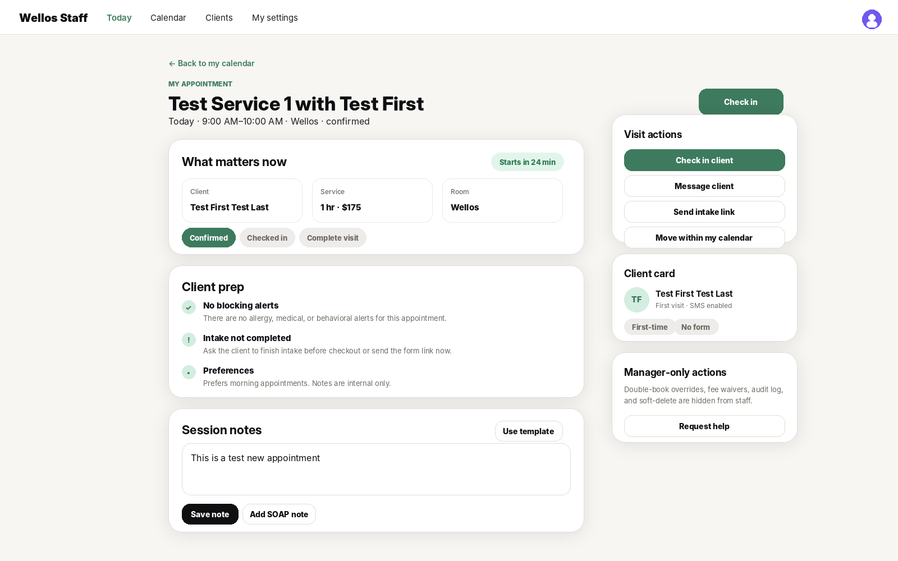
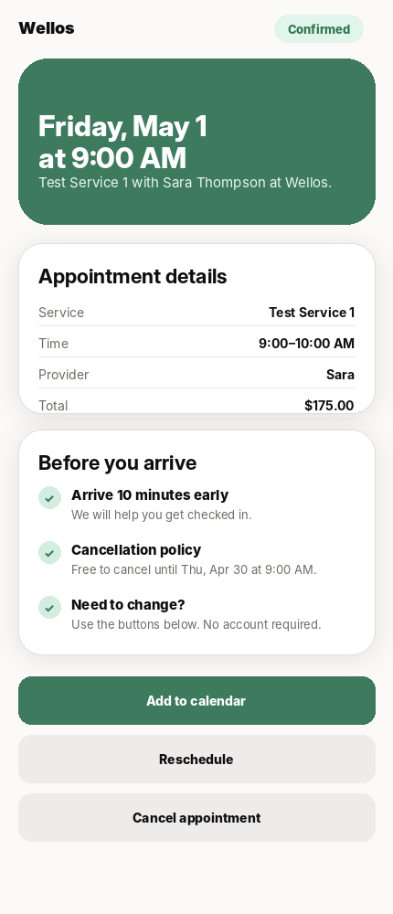
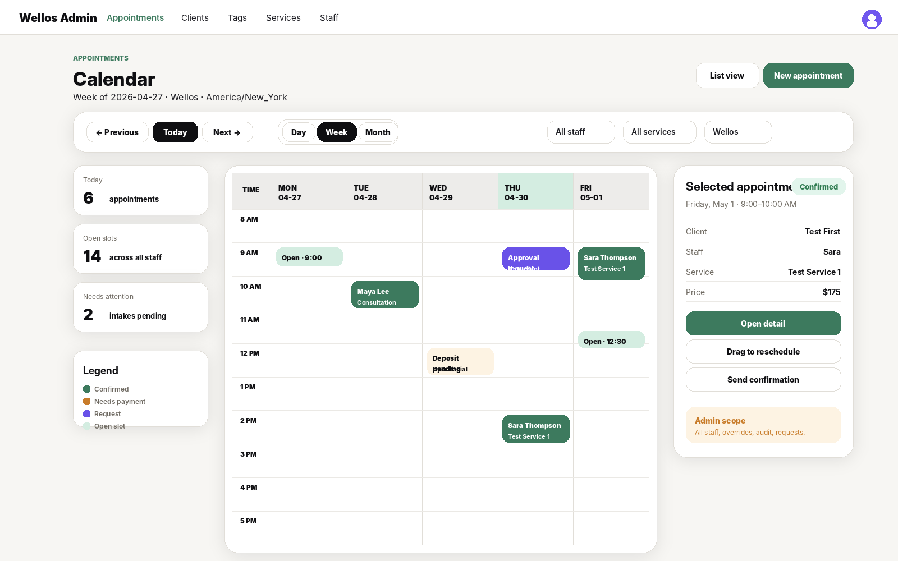
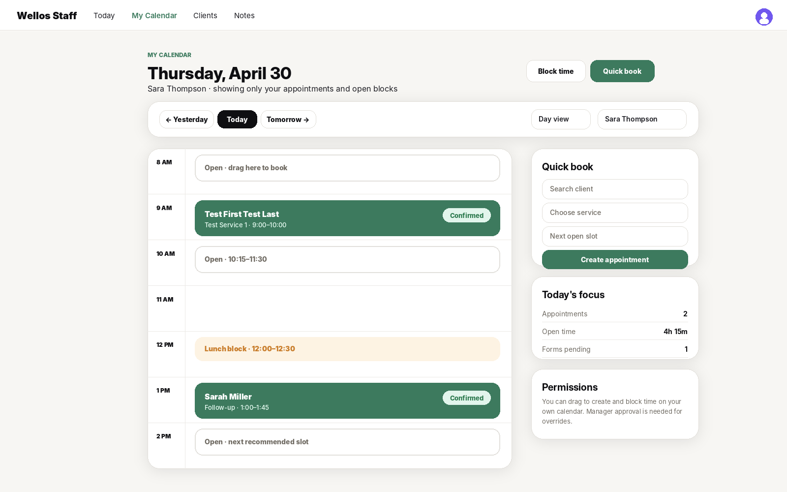
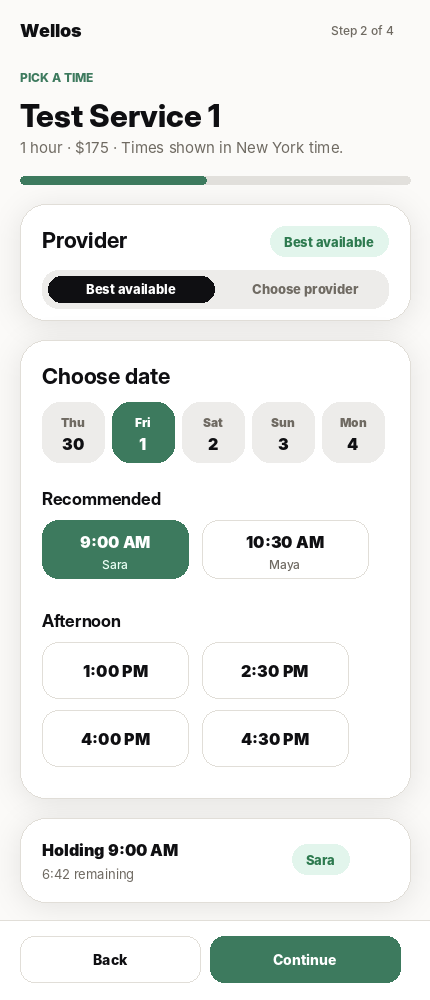

# Wellos Booking UI Build Walkthrough

**Scope:** redesign the post-booking appointment detail screen and the calendar / time-selection surfaces across **admin**, **staff**, and **customer** views.

This file is meant to be handed to the frontend build agent before Epic 3 work starts. It is focused on frontend structure, role-aware UI, screen behavior, and build order. The backend still owns availability, state transitions, slot holds, pricing, deposits, audit logs, and race-condition protection.

---

## 1. Image mockups

### Appointment detail screens

| View | Image | Purpose |
|---|---|---|
| Admin appointment detail |  | Full operational view: appointment state, client context, notes, audit trail, admin-only actions, soft-delete danger zone. |
| Staff appointment detail |  | Focused visit view: check-in, client prep, session notes, intake status, and staff-safe actions. |
| Customer appointment detail |  | Public/magic-link view: confirmation, arrival prep, exact cancellation policy, reschedule/cancel actions. |

### Calendar / booking time screens

| View | Image | Purpose |
|---|---|---|
| Admin calendar |  | All-staff operational calendar with filters, requests, open slots, selected appointment drawer, and admin scope. |
| Staff calendar |  | Own-calendar view for providers/staff with quick book, open blocks, drag-to-create, and block-time affordances. |
| Customer time selection |  | Public booking slot selection: provider preference, date rail, available slots, slot hold timer, continue CTA. |

---

## 2. Product direction

The appointment detail page and calendar should not feel like database CRUD pages. They should feel like an operations console.

The core rule is:

> The same appointment data exists underneath, but each persona gets a different surface.

Admin sees everything needed to run the business. Staff sees what they need to perform the appointment. Customers see only the clean public facts needed to arrive, reschedule, cancel, or add to calendar.

---

## 3. Role coverage

### 3.1 Admin view

Admin can:

- View all appointments across staff.
- View all staff calendars.
- Create appointments from the calendar or New Appointment page.
- Reschedule appointments.
- Change state: confirmed, checked in, in progress, completed, cancelled, no-show.
- Approve request-approval bookings.
- Override conflicts with a required reason.
- See audit history.
- Soft-delete only as an admin-only danger action.
- Waive fees if payments/cancellation logic is wired later.

Admin should not have to leave the appointment detail page for normal operational actions.

### 3.2 Staff view

Staff can:

- View their own schedule by default.
- View appointment details for appointments they own.
- Check in a client.
- Add session notes.
- Send an intake link.
- Message a client if notifications are wired.
- Drag to create on their own calendar.
- Block their own time, subject to company policy.
- Request help for manager-only actions.

Staff should **not** see:

- Audit log.
- Soft-delete.
- Fee waiver.
- Admin override.
- All-staff operational metrics unless their role allows it.

### 3.3 Customer view

Customer can:

- Book publicly without creating an account.
- Pick service, provider preference, date, and slot.
- See a slot hold countdown after choosing a time.
- See final appointment details after booking.
- Add to calendar.
- Reschedule by magic link.
- Cancel by magic link.
- See exact cancellation policy language.
- See prep instructions, directions, and arrival expectations.

Customer should never see internal notes, audit information, staff-only state controls, or admin/staff navigation.

---

## 4. Routes to build

### 4.1 Authenticated app routes

Use the existing admin app shell for MVP, but render role-specific variants inside the page. This avoids duplicating route trees before the role model is fully mature.

```txt
apps/web/app/admin/appointments/page.tsx
  List view of appointments

apps/web/app/admin/appointments/calendar/page.tsx
  Calendar shell; renders AdminCalendarView or StaffCalendarView based on role

apps/web/app/admin/appointments/new/page.tsx
  Appointment composer; creates appointments from form-first entry

apps/web/app/admin/appointments/[id]/page.tsx
  Appointment detail; renders AdminAppointmentDetail or StaffAppointmentDetail based on role
```

When a dedicated staff shell ships later, these can be moved or aliased to:

```txt
apps/web/app/staff/calendar/page.tsx
apps/web/app/staff/appointments/[id]/page.tsx
```

Do not block the MVP on that split.

### 4.2 Public customer routes

```txt
apps/web/app/book/[tenantSlug]/page.tsx
  Public booking portal start

apps/web/app/book/[tenantSlug]/time/page.tsx
  Customer time selection / slot hold screen

apps/web/app/book/[tenantSlug]/checkout/page.tsx
  Client details + payment/deposit screen when payments are wired

apps/web/app/book/[tenantSlug]/confirmation/[bookingId]/page.tsx
  Public confirmation screen

apps/web/app/book/manage/[token]/page.tsx
  Magic-link appointment detail, reschedule, and cancel
```

For MVP, the public confirmation and magic-link management screen can share the same `CustomerAppointmentDetail` component with mode-specific actions.

---

## 5. Component architecture

Build these components once and compose them into role-specific screens.

```txt
components/appointments/
  AppointmentPageHeader.tsx
  AppointmentSnapshotCard.tsx
  AppointmentStatePanel.tsx
  AppointmentActionsPanel.tsx
  ClientContextPanel.tsx
  AppointmentNotesPanel.tsx
  AppointmentAuditPanel.tsx
  AdminDangerZone.tsx
  CustomerAppointmentSummary.tsx
  CustomerPrepInstructions.tsx
  AppointmentPolicyCard.tsx

components/calendar/
  CalendarShell.tsx
  CalendarToolbar.tsx
  CalendarFilters.tsx
  AdminCalendarView.tsx
  StaffCalendarView.tsx
  CalendarGrid.tsx
  CalendarEventCard.tsx
  OpenSlotCard.tsx
  SelectedAppointmentDrawer.tsx
  DragCreateLayer.tsx
  BlockTimeDrawer.tsx

components/booking/
  AppointmentComposer.tsx
  ClientPicker.tsx
  NewClientInlineForm.tsx
  ServicePicker.tsx
  StaffPreferenceControl.tsx
  PublicDateRail.tsx
  AvailabilityPanel.tsx
  SlotCard.tsx
  SlotHoldTimer.tsx
  BookingSummaryBar.tsx
```

### Component rule

Components should receive a role-aware view model. They should not perform permission decisions locally except for small display branches.

Preferred pattern:

```ts
type AppointmentViewMode = 'admin' | 'staff' | 'customer';

interface AppointmentDetailViewModel {
  mode: AppointmentViewMode;
  appointment: AppointmentDisplay;
  allowedActions: AppointmentAction[];
  visiblePanels: {
    clientContext: boolean;
    internalNotes: boolean;
    auditTrail: boolean;
    adminDangerZone: boolean;
    customerPrep: boolean;
  };
}
```

The server/action loader decides what the user can see. The component renders what it is given.

---

## 6. Appointment detail behavior

### 6.1 Admin appointment detail

Admin appointment detail should use this hierarchy:

```txt
Header
  Back link
  Appointment label
  Date/time title
  Status pill
  One-line summary

Main column
  Appointment snapshot
  State and next steps
  Client context / alerts / tags
  Internal notes
  Audit trail

Right column
  Quick actions
  Booking facts
  Admin controls / danger zone
```

Primary action order:

1. Check in
2. Reschedule
3. Send confirmation
4. Cancel / no-show
5. Soft-delete only in danger zone

Soft-delete copy must explain that cancellation is the correct way to free the slot. Soft-delete hides the record from normal calendar/list surfaces while preserving audit history.

### 6.2 Staff appointment detail

Staff appointment detail should use this hierarchy:

```txt
Header
  Back to my calendar
  Appointment title
  Start/end/location
  Primary check-in CTA

Main column
  What matters now
  Client prep
  Session notes

Right column
  Visit actions
  Client card
  Manager-only actions explanation
```

The staff view should feel lighter than the admin view. It should remove administrative risk from the screen and center the actual appointment.

### 6.3 Customer appointment detail

Customer appointment detail should be mobile-first:

```txt
Hero
  You're booked
  Date/time
  Service/provider/location

Appointment details
  Service
  Time
  Provider
  Total

Before you arrive
  Arrival instructions
  Cancellation policy
  Change/cancel explanation

Actions
  Add to calendar
  Reschedule
  Cancel appointment
```

The customer view must use exact cancellation language:

```txt
Free to cancel until Thu, Apr 30 at 9:00 AM.
```

Avoid vague copy like “24-hour cancellation policy” when an exact timestamp is available.

---

## 7. Calendar behavior

### 7.1 Admin calendar

Admin calendar should support:

- Day / week / month toggle.
- Staff filter.
- Service filter.
- Location filter, hidden if only one location exists.
- All-staff view.
- Requests and pending-payment states.
- Open slot indicators.
- Selected appointment drawer.
- Drag-to-create on any staff/day column, subject to permissions.
- Drag-to-reschedule with server-side revalidation.

Admin calendar should default to week view on desktop and day view on mobile.

### 7.2 Staff calendar

Staff calendar should support:

- Own-calendar default.
- Day view first.
- Today navigation.
- Quick Book side panel on desktop.
- Open-slot rows.
- Appointment cards.
- Block-time creation.
- Drag-to-create on own calendar.
- Restricted manager-only actions.

Staff should not have to scan all staff columns to understand their day.

### 7.3 Customer time selection

Customer time selection is not the same UI as the admin/staff calendar. It should be a mobile-first slot picker:

```txt
Service summary
Provider preference
  Best available
  Choose provider
Date rail
Available slots
Slot hold timer
Continue CTA
```

Default to **Best available**. Provider choice should be a filter, not a required decision.

After slot selection, create a hold and show:

```txt
Holding 9:00 AM
6:42 remaining
```

If the hold expires, disable Continue and return the user to fresh availability.

---

## 8. Data contracts for frontend wiring

The exact backend names can change, but the frontend should be built around these concepts.

### 8.1 Appointment detail loader

```ts
GET /admin/appointments/:id
```

Expected display shape:

```ts
type AppointmentDisplay = {
  id: string;
  status: 'confirmed' | 'checked_in' | 'in_progress' | 'completed' | 'cancelled' | 'no_show';
  startsAtUtc: string;
  endsAtUtc: string;
  timezone: string;
  client: {
    id: string;
    name: string;
    phone?: string;
    email?: string;
    tags: { id: string; name: string; color: string }[];
    alertCount: number;
  };
  service: {
    id: string;
    name: string;
    durationMinutes: number;
    priceCents: number;
    color?: string;
  };
  staff: {
    id: string;
    name: string;
  };
  location: {
    id: string;
    name: string;
  };
  notes?: string;
  policy?: {
    cancellationFreeUntilLocal: string;
    cancellationFeeCents?: number;
  };
};
```

### 8.2 Calendar loader

```ts
GET /admin/appointments/calendar?start=2026-04-27&end=2026-05-03&staffId=any&serviceId=any
```

Expected display shape:

```ts
type CalendarResponse = {
  range: { startLocal: string; endLocal: string; timezone: string };
  staff: { id: string; name: string; color?: string }[];
  appointments: CalendarAppointment[];
  openSlots?: CalendarOpenSlot[];
  requests?: CalendarRequest[];
};
```

### 8.3 Public availability loader

```ts
GET /book/:tenantSlug/availability?serviceId=svc_123&date=2026-05-01&staffPreference=best_available
```

Expected display shape:

```ts
type PublicAvailabilityResponse = {
  timezone: string;
  service: { id: string; name: string; durationMinutes: number; priceCents: number };
  dates: PublicDateOption[];
  slots: {
    startUtc: string;
    endUtc: string;
    displayTime: string;
    staff: { id: string; firstName: string };
    recommended?: boolean;
  }[];
};
```

### 8.4 Slot hold

```ts
POST /book/:tenantSlug/holds
```

Request:

```ts
{
  serviceId: string;
  staffId: string;
  startUtc: string;
  endUtc: string;
}
```

Response:

```ts
{
  holdId: string;
  expiresAtUtc: string;
}
```

Do not let the customer continue to checkout or confirmation without a valid hold.

---

## 9. Frontend state machines

### 9.1 Appointment detail state

```txt
LOADING
  → READY
  → SAVING_NOTES
  → TRANSITIONING_STATE
  → RESCHEDULING
  → ERROR
```

State transition actions must always be optimistic only when they can be rolled back clearly. For high-risk actions like cancellation or no-show, use a confirmation step.

### 9.2 Calendar state

```txt
LOADING_CALENDAR
  → READY
  → DRAGGING_CREATE
  → DRAWER_OPEN
  → CREATING_APPOINTMENT
  → RESCHEDULING_APPOINTMENT
  → ERROR
```

When the user drags to create, the visual block can be optimistic. The appointment itself should not appear as confirmed until the server creates it.

### 9.3 Public booking state

```txt
SERVICE_SELECTED
  → AVAILABILITY_LOADING
  → AVAILABILITY_READY
  → SLOT_SELECTED
  → SLOT_HELD
  → CLIENT_DETAILS
  → PAYMENT_OR_CONFIRMATION
  → BOOKING_CONFIRMED
```

Error states:

```txt
AVAILABILITY_FAILED
SLOT_HOLD_FAILED
HOLD_EXPIRED
PAYMENT_FAILED
BOOKING_CREATION_FAILED
```

---

## 10. Build order

### Ticket 1 — Shared UI primitives for appointment/calendar

Build:

- `AppointmentPageHeader`
- `AppointmentSnapshotCard`
- `AppointmentStatePanel`
- `AppointmentActionsPanel`
- `CalendarEventCard`
- `OpenSlotCard`
- `SelectedAppointmentDrawer`

Acceptance:

- Static Storybook/component-gallery states exist.
- Admin/staff/customer variants can be previewed without live API data.

### Ticket 2 — Admin appointment detail

Build:

- `/admin/appointments/[id]/page.tsx`
- Admin variant panels.
- Notes save action.
- State transition buttons.
- Danger zone.

Acceptance:

- Confirmed appointment renders.
- Notes can be saved.
- Admin-only controls are visible only to admin/manager/owner roles.
- Staff role does not see audit trail or danger zone.

### Ticket 3 — Staff appointment detail

Build:

- Staff role variant on the same appointment detail route.
- Client prep panel.
- Staff-safe actions.
- Manager-only explanation card.

Acceptance:

- Staff can open only their own appointments unless role allows broader access.
- Check-in action is visible.
- Admin-only actions are hidden.

### Ticket 4 — Admin calendar

Build:

- `/admin/appointments/calendar/page.tsx`
- Calendar toolbar.
- Week/day view skeleton.
- Admin filters.
- Appointment drawer.
- Request/pending/open-slot visual states.

Acceptance:

- Admin sees all staff appointments.
- Filters update query string.
- Clicking an appointment opens drawer.
- Drawer links to appointment detail.

### Ticket 5 — Staff calendar

Build:

- Staff variant of calendar route.
- Own-calendar default.
- Quick Book side panel placeholder.
- Block-time action placeholder.

Acceptance:

- Staff sees own calendar first.
- Staff cannot drag-create on other staff calendars.
- Staff cannot see all-staff metrics unless role permits.

### Ticket 6 — Public customer time selection

Build:

- `PublicDateRail`
- `StaffPreferenceControl`
- `AvailabilityPanel`
- `SlotCard`
- `SlotHoldTimer`

Acceptance:

- Best available is default.
- Selecting a slot creates a hold.
- Hold timer appears.
- Expired hold disables continue.
- Provider choice behaves as a filter.

### Ticket 7 — Customer appointment detail / magic-link management

Build:

- Confirmation view.
- Magic-link detail view.
- Reschedule/cancel action placeholders.
- Exact cancellation timestamp display.

Acceptance:

- Customer can view appointment without logging in.
- Internal notes are never exposed.
- Reschedule/cancel actions are available only when token permissions allow them.

### Ticket 8 — Loading, empty, and error states

Build:

- Skeletons for calendar and appointment detail.
- Empty day/calendar states.
- No availability state.
- Slot taken state.
- Hold expired state.
- Permission denied state.

Acceptance:

- No surface shows a blank white page while loading.
- Every failed async action gives a clear next step.
- Slot-unavailable error automatically refreshes availability.

---

## 11. Permission rules

Frontend visibility should mirror backend authorization. Do not rely on frontend hiding for security.

| Action | Admin / owner | Manager | Staff/provider | Customer |
|---|:---:|:---:|:---:|:---:|
| View all calendars | Yes | Yes | No | No |
| View own calendar | Yes | Yes | Yes | No |
| Create appointment | Yes | Yes | Yes, own scope | No, uses public booking |
| Drag-to-create on other staff | Yes | Yes | No | No |
| Check in appointment | Yes | Yes | Own appointments | No |
| Cancel appointment | Yes | Yes | Own appointments | Magic link only |
| Override double-book | Yes | Yes | Request only | No |
| View audit trail | Yes | Yes | No | No |
| Soft-delete | Yes | Manager optional | No | No |
| Reschedule via public link | No | No | No | Yes |

---

## 12. UX details to preserve

- Use warm surface background, white cards, soft borders, and sage accent.
- Keep primary actions green.
- Use black/dark buttons sparingly for secondary but important internal actions.
- Use red only for destructive actions.
- Do not show disabled buttons without a reason.
- Do not show the location selector when only one location exists.
- Do not force customers to choose a provider before seeing slots.
- Do not show all admin fields to staff.
- Do not show internal appointment notes to customers.
- Keep customer booking mobile-first.
- Keep staff screens fast and operational.

---

## 13. Frontend acceptance checklist

### Admin appointment detail

- [ ] Shows appointment summary and current state.
- [ ] Shows allowed next state transitions.
- [ ] Shows client context, tags, and alerts.
- [ ] Allows notes save.
- [ ] Shows audit trail.
- [ ] Shows admin-only danger zone.
- [ ] Soft-delete copy explains cancellation vs soft-delete.

### Staff appointment detail

- [ ] Shows only staff-safe action set.
- [ ] Centers check-in and client prep.
- [ ] Shows session notes.
- [ ] Hides audit and danger zone.
- [ ] Explains manager-only actions without exposing them as disabled controls.

### Customer appointment detail

- [ ] No login required.
- [ ] Shows service, provider, date/time, location, and total.
- [ ] Shows prep instructions.
- [ ] Shows exact cancellation cutoff.
- [ ] Supports add-to-calendar, reschedule, and cancel actions.
- [ ] Never exposes internal notes.

### Admin calendar

- [ ] Shows all staff and all appointments.
- [ ] Supports day/week/month controls.
- [ ] Supports staff/service/location filters.
- [ ] Shows confirmed, request, pending-payment, and open-slot states.
- [ ] Opens selected appointment drawer.
- [ ] Links to detail page.

### Staff calendar

- [ ] Defaults to current staff member.
- [ ] Shows own appointments and open blocks.
- [ ] Supports quick book placeholder or live widget.
- [ ] Supports block-time placeholder or live drawer.
- [ ] Restricts cross-staff actions.

### Customer time selection

- [ ] Best available is default.
- [ ] Date rail is thumb-friendly.
- [ ] Slots are grouped and readable.
- [ ] Slot hold timer appears after selection.
- [ ] Expired hold sends customer back to availability.

---

## 14. Final implementation principle

The frontend should be built as one appointment/calendar system with persona-specific renderers:

```txt
Shared data model
  → shared view model builder
    → admin renderer
    → staff renderer
    → customer renderer
```

That keeps the UX different where it should be different, without creating three disconnected products.
