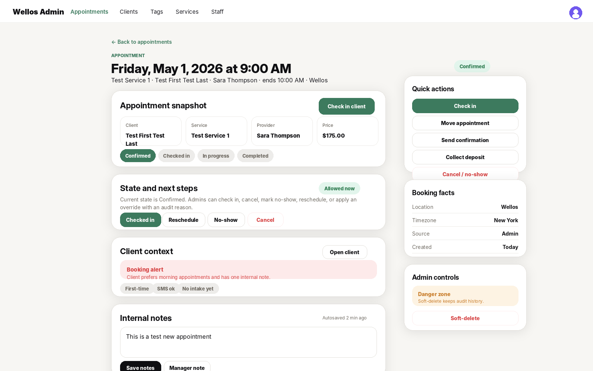
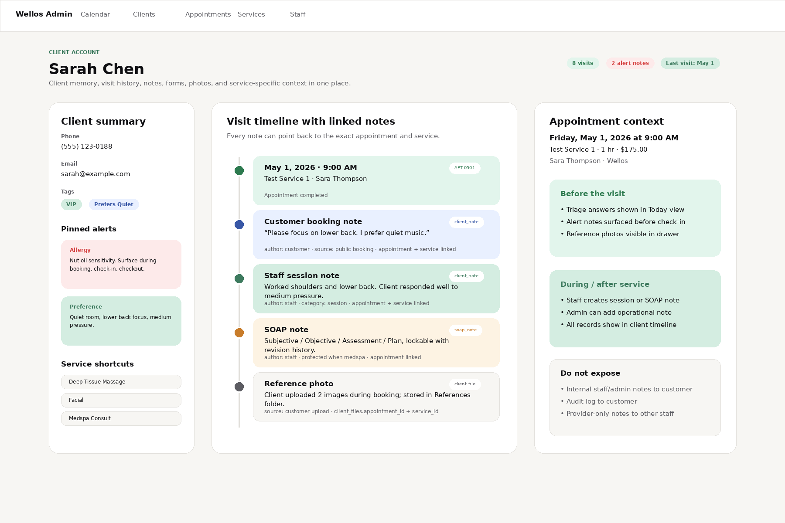
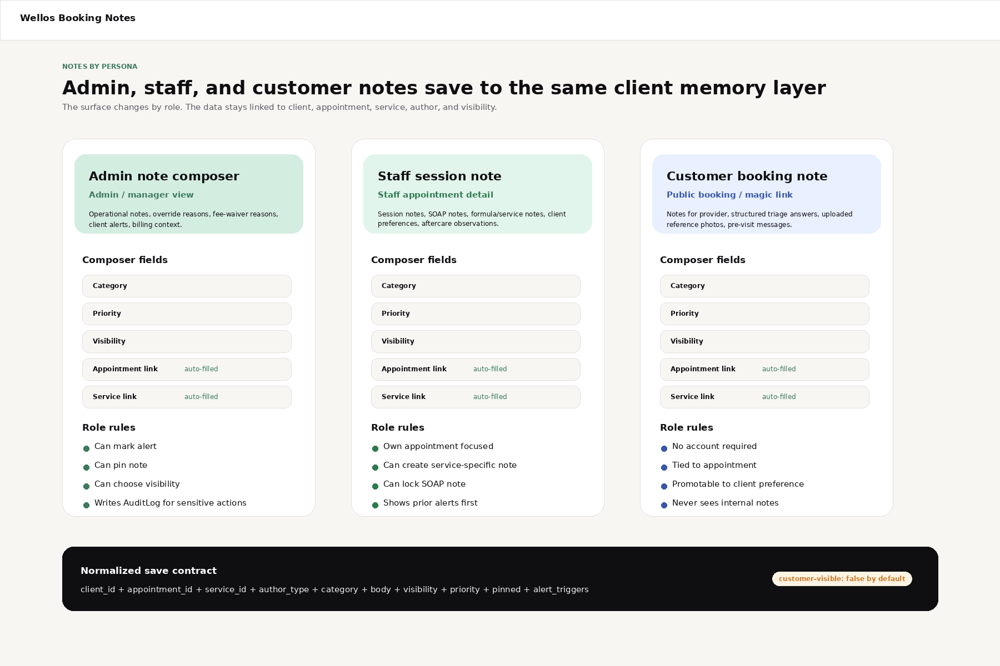

# Wellos Booking UI Build Walkthrough — v2 Notes + Full Feature Coverage

**Scope:** frontend walkthrough for the booking, appointment detail, calendar, customer management, and client-account note/history experience across **admin**, **staff**, and **customer** views.

This is the updated handoff version. It keeps the original six UI mockups and adds the missing client-memory requirement: **notes from staff, admin, and customers must save in the client account and link back to the exact appointment, service, author, and visibility context.**

---

## 1. Image mockups

### Appointment detail screens

| View | Image | Purpose |
|---|---|---|
| Admin appointment detail |  | Full operational view: appointment state, client context, notes, audit trail, admin-only actions, and soft-delete danger zone. |
| Staff appointment detail |  | Focused visit view: check-in, client prep, session notes, intake status, staff-safe actions. |
| Customer appointment detail |  | Public/magic-link view: confirmation, prep, exact cancellation policy, reschedule/cancel actions. |

### Calendar / booking time screens

| View | Image | Purpose |
|---|---|---|
| Admin calendar |  | All-staff operational calendar with filters, requests, open slots, selected appointment drawer, and admin scope. |
| Staff calendar |  | Own-calendar view for providers/staff with quick book, open blocks, drag-to-create, and block-time affordances. |
| Customer time selection |  | Public booking slot selection: provider preference, date rail, available slots, slot hold timer, continue CTA. |

### New client memory / notes screens

| View | Image | Purpose |
|---|---|---|
| Client account linked notes |  | Shows how every appointment, staff note, customer note, SOAP note, and reference photo becomes part of the client account timeline. |
| Notes by persona |  | Shows the role-specific note composer surfaces for admin, staff, and customer while saving through one normalized data contract. |

---

## 2. Non-negotiable product rule

The booking UI is not just a calendar. It is the entry point into the client record.

Every meaningful note or answer must be recoverable later from two places:

```txt
Client account → Visit timeline → Appointment → Service → Notes / answers / files
Appointment detail → Linked client notes / answers / files / SOAP notes
```

That means:

- A customer note entered during public booking must save to the client account.
- A staff session note must save to the client account and link to the appointment.
- An admin note must save to the client account with the correct internal visibility.
- A SOAP note must link to the appointment.
- Reference photos uploaded during booking must link to the client, appointment, and service.
- Triage answers must be visible on the appointment and recoverable from the client timeline.
- Customers must never see internal staff/admin notes.

---

## 3. Feature coverage from the booking specs

This walkthrough must cover the full booking feature set, not only the screens shown in the current product.

| Feature / benefit | Frontend surface | Covered behavior |
|---|---|---|
| Login-free public booking | Customer booking portal | Service → provider preference → time → preferences/add-ons → details/payment → confirmation. |
| First-time client booking | Customer booking portal | Create/find client during booking; no account required. |
| Returning client detection | Customer booking details + confirmation | Silent match by email + phone/name; saved card offered; “This isn’t me” escape hatch. |
| Booking policies | Customer/admin settings-aware UI | Supports **Instant**, **Request approval**, and **Staff-only** booking experiences. |
| Request approval | Customer confirmation + admin/staff queue | Appointment enters requested state; staff/admin approve or decline. |
| Staff-only booking | Public fallback page | Branded contact-to-book page with phone/email/contact form. |
| Real-time availability | Customer time picker + admin/staff calendar | Availability computed server-side from working hours, buffers, blocks, appointments, holds, external busy blocks. |
| Slot holds | Customer time picker | Hold timer after selecting a slot; expired holds disable progress and refresh availability. |
| Add-ons / enhancements | Customer booking flow | Compatible add-ons only; duration-changing add-ons trigger availability recheck. |
| Deposits / full / optional payment | Customer details/payment | Server-calculated totals; deposit disclosure; saved card/no-show fee disclosure. |
| Exact cancellation policy | Customer checkout + confirmation + appointment detail | Display exact cutoff timestamp and exact fee, not vague “24-hour policy” copy. |
| Magic-link reschedule/cancel | Customer manage route | Customer can reschedule or cancel without login through signed token. |
| Waitlist signup/conversion | Customer no-availability state | Join waitlist, receive SMS offer, 15-minute conversion hold, expiration handling. |
| Intake form trigger | Customer confirmation + staff detail | Show “quick intake form” after booking; staff sees pending/complete status. |
| Post-review tip | Post-review customer flow | 5-star/no-checkout-tip trigger; saved-card tip; ledger linked to appointment/staff/review. |
| Quick Book | Dashboard/staff/admin | Fast staff booking from dashboard; same create endpoint, no full payment flow. |
| Calendar drag-to-create | Admin/staff calendar | Drag empty slot, open appointment drawer, prefill staff/time, create appointment. |
| Walk-in booking | Staff/admin composer | New client inline with first, last, phone required; email optional. |
| Block time off | Staff/admin calendar | Staff blocks own time; manager/owner approves larger/conflicting blocks. |
| Manager override | Admin calendar/detail | Double-book requires permission, reason, visual conflict indicator, audit entry. |
| Staff drag reschedule | Staff/admin calendar | Drop appointment to new time/staff; server revalidates staff/service compatibility. |
| Staff-initiated cancel | Appointment detail | Cancels without client fee; client notification; optional rebook suggestions. |
| Branded booking page | Customer service selection | Trust panel with story, testimonials, FAQ, business proof. |
| Service detail sheet | Customer service selection | Gallery, long description, what to expect, prep, highlight review. |
| Provider profile sheet | Customer provider selection | Bio, specialties, years, gallery, review; selection through explicit CTA. |
| Triage questions | Customer booking step 3a | Chips/sliders/text/photo questions, stored per appointment. |
| Reference photo upload | Customer booking step 3a + client account | Up to 3 images; EXIF stripped; linked to appointment/service/client. |
| Prep and aftercare | Confirmation + reminders + appointment detail | “Before your visit” panel and reminder/aftercare content. |
| Direct booking links | Settings + public router | Service links, staff links, service+staff links, tracked campaign links. |
| Embeddable widget | Tenant website | iframe/JS embed using same flow, campaign analytics via postMessage. |
| Round-robin assignment | Availability/booking settings | Any-available strategy supports preferred-first, round-robin, load-balanced, priority-weighted. |
| Medspa contraindication gating | Customer triage | Gating question blocks unsafe services before slot hold or appointment creation. |
| Wallet/share/confirmation number | Customer confirmation | Apple/Google Wallet, share link, confirmation number for support. |
| Accessibility | All new booking components | 44px+ touch targets, aria-expanded, aria-live timer behavior, reduced motion support. |

---

## 4. Notes and client memory system

### 4.1 Why this needs to exist

The appointment detail screen in the current build has an internal notes textarea. That is not enough.

A wellness business needs to answer questions months later:

- What service was done?
- Who performed it?
- What did the client ask for?
- What did the staff actually do?
- Were there allergies, contraindications, formulas, or preferences?
- Was there a photo or intake answer attached?
- Who wrote the note and when?

So the frontend should treat notes as **client memory**, not just appointment text.

### 4.2 Note sources

| Source | Example | Saves where | Linked to appointment? | Linked to service? | Customer-visible? |
|---|---|---|---:|---:|---:|
| Customer booking note | “Focus on lower back, quiet music please.” | `client_notes` + appointment snapshot | Yes | Yes | Staff-visible, not public after submit unless exposed intentionally. |
| Customer triage answer | Pressure: medium; Focus: lower back | `appointment_booking_answers` | Yes | Through appointment/service | Staff-visible. Can be promoted to permanent client preference. |
| Customer reference photo | Hair inspo / medspa concern photo | `client_files` | Yes | Yes | Staff-visible. Customer owns upload but does not see internal staff notes. |
| Staff session note | “Worked shoulders/lower back; medium pressure.” | `client_notes` | Yes | Yes | Internal by default. |
| Staff SOAP note | Subjective/objective/assessment/plan | `soap_notes` | Yes | Through appointment/service | Staff/clinical-visible by permissions. |
| Staff formula note | “Wella 6N + 20 vol, 35 min.” | `client_notes` category `formula` | Optional but preferred | Yes | Internal. |
| Admin operational note | “Fee waived after staff cancel.” | `client_notes` or `AuditLog` depending action | Yes when appointment-related | Optional | Internal only. |
| Override/cancel/no-show reason | Required reason for risky transition | `AuditLog`, optionally appointment note | Yes | Optional | Internal only. |
| Alert note | Allergy/medical/behavioral warning | `client_notes` priority `alert` | Optional | Optional | Internal; surfaced at booking/check-in/checkout. |

### 4.3 Data model recommendation

The current CRM spec already has a structured `client_notes` model with categories, priority, appointment linkage, service linkage, visibility, alert triggers, pinned state, and archive/expiry support. For this booking build, extend the author model so customer-authored notes can be stored without pretending a staff member wrote them.

Recommended shape:

```ts
type ClientNote = {
  id: string;
  tenantId: string;
  clientId: string;

  category:
    | 'general'
    | 'preference'
    | 'formula'
    | 'allergy'
    | 'medical'
    | 'clinical'
    | 'behavioral'
    | 'billing'
    | 'relationship'
    | 'internal'
    | 'session'
    | 'customer_request';

  priority: 'normal' | 'alert';
  title?: string;
  body: string;

  appointmentId?: string;
  serviceId?: string;

  authorType: 'customer' | 'staff' | 'admin' | 'system';
  authorStaffId?: string;
  authorClientId?: string;

  sourceSurface:
    | 'public_booking'
    | 'magic_link_manage'
    | 'appointment_detail'
    | 'calendar_drawer'
    | 'client_profile'
    | 'intake_form'
    | 'system_transition';

  visibility:
    | 'location'
    | 'provider_only'
    | 'admin_only'
    | 'customer_submitted'
    | 'protected_clinical';

  customerVisible: boolean;
  alertTriggers: ('booking' | 'check_in' | 'checkout')[];
  pinned: boolean;
  expiresAt?: string;
  archivedAt?: string;

  createdAt: string;
  updatedAt: string;
};
```

**Default visibility rules:**

- Customer-submitted booking notes are staff-visible and linked to the appointment, but customers do not get an internal-note feed.
- Staff session notes are internal by default.
- Admin notes are `admin_only` unless explicitly marked location-visible.
- Allergy/medical/behavioral alert notes surface to staff at booking/check-in/checkout.
- SOAP/clinical notes follow protected-record permissions when medspa/clinical features are enabled.

### 4.4 Appointment detail note panels

Admin appointment detail should show:

```txt
Client context
  Alerts
  Pinned notes
  Last 3 visits
  Service-specific notes

Linked notes for this appointment
  Customer booking note
  Triage answers
  Reference photos
  Staff session notes
  SOAP note
  Admin operational notes

Audit trail
  State changes
  Override reasons
  Notifications sent
  Soft-delete/cancel actions
```

Staff appointment detail should show:

```txt
Before the visit
  Alerts
  Pinned notes
  Triage answers
  Intake status
  Reference photos
  Last related service notes

During / after the visit
  Add session note
  Add SOAP note if enabled
  Add formula/service note if enabled
  Pin important preference
```

Customer appointment detail should show:

```txt
Public appointment facts only
  Service
  Provider
  Time
  Location
  Prep instructions
  Cancellation policy
  Reschedule/cancel actions

Customer can submit/update only:
  Notes for provider before visit
  Preference answers if editable
  Reference photo uploads if service allows
```

Customer view must never show internal notes, audit logs, override reasons, admin notes, billing notes, behavioral notes, or provider-only notes.

---

## 5. Client account visit timeline

The client account should have a **Visit timeline** tab.

Recommended layout:

```txt
Client profile
  Summary / contact / tags / alerts
  Visit timeline
    Appointment card
      Date/time/status
      Service/provider/location
      Payment/deposit summary
      Intake/form status
      Linked notes
      Linked files/photos
      Linked SOAP note
      Booking answers
      Actions: View appointment, Add note, Add file
  Notes
    Filter by category, service, author, priority
  Files
  Forms
  Payments
```

### Timeline rules

- Every completed appointment is a timeline item.
- Every note with `appointmentId` appears under that appointment.
- Every note with only `serviceId` appears in service-specific context and should surface when that service is booked again.
- Every alert-priority note can appear above the timeline as a pinned alert.
- Triage answers are shown under their appointment, not mixed into the free-text notes list unless promoted.
- Staff can click **Make permanent preference** on a triage answer to create a durable `client_notes` preference note.

---

## 6. Role-specific frontend behavior

### 6.1 Admin view

Admin/owner/manager can:

- View all notes on a client except protected clinical notes without permission.
- Add admin-only notes.
- Add location-visible notes.
- Add alert notes.
- Pin notes.
- Archive notes.
- Add override/cancel/no-show reasons.
- See audit trail.
- See note author and source surface.
- Filter client timeline by service, staff, category, and appointment.

Admin should see a warning before adding customer-visible notes. Default should be internal.

### 6.2 Staff view

Staff/provider can:

- View notes relevant to their own appointments.
- View safety-critical alerts.
- View pinned preferences and service-specific notes.
- Add session notes.
- Add service/formula notes.
- Add SOAP notes if feature/permission enabled.
- Promote customer triage answer to a permanent preference note.

Staff should not see admin-only billing notes, audit trail, soft-delete controls, or manager override controls.

### 6.3 Customer view

Customer can:

- Enter “Notes for your provider” during booking.
- Answer structured preference/triage questions.
- Upload reference photos when allowed by service.
- Add a pre-visit message through magic link if appointment is still upcoming.
- See their appointment details, prep instructions, policy, and public status.

Customer cannot:

- See staff/admin internal notes.
- See staff SOAP notes unless a future clinical-record access feature explicitly allows it.
- See audit trail.
- See other clients or staff-only state history.

---

## 7. Frontend components to add

```txt
components/client-memory/
  ClientVisitTimeline.tsx
  ClientTimelineAppointmentCard.tsx
  LinkedNotesList.tsx
  LinkedFilesList.tsx
  ServiceContextNotes.tsx
  ClientAlertStack.tsx
  NoteCategoryBadge.tsx
  NoteVisibilityBadge.tsx
  NoteAuthorLine.tsx

components/appointments/
  AppointmentLinkedNotesPanel.tsx
  AppointmentBookingAnswersPanel.tsx
  AppointmentReferencePhotosPanel.tsx
  RoleNoteComposer.tsx
  StaffSessionNoteComposer.tsx
  AdminOperationalNoteComposer.tsx
  CustomerPreVisitNoteComposer.tsx
  SoapNotePanel.tsx
  PromoteAnswerToNoteButton.tsx
```

### Composer behavior

`RoleNoteComposer` receives a role-aware config from the server:

```ts
type NoteComposerConfig = {
  role: 'admin' | 'manager' | 'staff' | 'customer';
  clientId: string;
  appointmentId?: string;
  serviceId?: string;
  allowedCategories: string[];
  allowedVisibility: string[];
  canPin: boolean;
  canMarkAlert: boolean;
  defaultCategory: string;
  defaultVisibility: string;
  customerVisibleAllowed: boolean;
};
```

Frontend should not infer sensitive permissions locally. Backend returns the allowed config.

---

## 8. API contracts for notes and linked history

### 8.1 Client timeline

```txt
GET /admin/clients/:clientId/timeline
```

Returns appointments and linked records:

```ts
type ClientTimelineResponse = {
  client: ClientSummary;
  alerts: ClientNote[];
  visits: {
    appointment: AppointmentDisplay;
    service: ServiceSummary;
    staff: StaffSummary;
    notes: ClientNote[];
    bookingAnswers: AppointmentBookingAnswer[];
    files: ClientFile[];
    soapNote?: SoapNoteSummary;
    auditSummary?: AuditSummary; // admin only
  }[];
};
```

### 8.2 Appointment linked notes

```txt
GET /admin/appointments/:appointmentId/linked-records
```

Returns:

```ts
type AppointmentLinkedRecords = {
  appointment: AppointmentDisplay;
  clientAlerts: ClientNote[];
  pinnedClientNotes: ClientNote[];
  serviceNotes: ClientNote[];
  appointmentNotes: ClientNote[];
  bookingAnswers: AppointmentBookingAnswer[];
  referenceFiles: ClientFile[];
  soapNote?: SoapNoteSummary;
};
```

### 8.3 Create note from appointment detail

```txt
POST /admin/appointments/:appointmentId/notes
```

Request:

```ts
{
  clientId: string;
  serviceId?: string;
  category: string;
  priority?: 'normal' | 'alert';
  title?: string;
  body: string;
  visibility: 'location' | 'provider_only' | 'admin_only';
  pinned?: boolean;
  alertTriggers?: ('booking' | 'check_in' | 'checkout')[];
}
```

Backend automatically sets `appointmentId`, author, source surface, and audit metadata.

### 8.4 Create customer pre-visit note

```txt
POST /book/manage/:token/appointments/:appointmentId/customer-note
```

Request:

```ts
{
  body: string;
}
```

Backend derives client and appointment from the signed token. It creates a customer-authored note with:

```txt
category = customer_request
sourceSurface = magic_link_manage
visibility = customer_submitted
customerVisible = false
appointmentId = token.appointmentId
serviceId = appointment.serviceId
```

### 8.5 Promote triage answer to permanent note

```txt
POST /admin/appointments/:appointmentId/booking-answers/:answerId/promote-to-note
```

Request:

```ts
{
  category: 'preference' | 'allergy' | 'medical' | 'general';
  title?: string;
  pinned?: boolean;
  alertTriggers?: ('booking' | 'check_in' | 'checkout')[];
}
```

Use this for answers like “nut oil allergy” or “quiet room preferred” that should persist beyond one appointment.

---

## 9. Calendar behavior with notes

### Admin calendar

Appointment cards and drawers should show:

- Alert count badge when client has alert-priority notes.
- Intake pending/complete indicator.
- Triage answer preview for upcoming appointment.
- Reference photo indicator.
- Linked note count.
- Drawer action: **Add note**.
- Drawer action: **Open client timeline**.

### Staff calendar

Staff calendar should show less metadata, but it must surface what matters:

```txt
Appointment card
  Client name
  Service
  Alert dot if alerts exist
  Intake icon if pending
  Prep icon if triage answers/photos exist
```

Clicking the appointment opens the staff briefing drawer:

1. Alert-priority notes.
2. Pinned notes.
3. Triage answers.
4. Reference photos.
5. Recent notes for the same service.
6. Session note composer.

### Customer time selection / customer detail

Customer booking flow collects:

- Notes for provider.
- Service-specific triage answers.
- Reference photos.

Customer confirmation and magic-link management show:

- Public appointment facts.
- Prep instructions.
- Intake status.
- “Update note for provider” only if the business allows changes before visit.

---

## 10. Build order update

Add these tickets after the base appointment/calendar UI tickets.

### Ticket 9 — Client memory timeline

Build:

- `ClientVisitTimeline`
- linked appointment cards
- note/file/answer grouping
- client alerts stack

Acceptance:

- Client profile shows visits in reverse chronological order.
- A note created from an appointment appears under that visit.
- A service-specific note appears when filtering by that service.

### Ticket 10 — Role-aware note composers

Build:

- Admin note composer.
- Staff session note composer.
- Customer pre-visit note composer.
- Category/visibility/priority controls based on server config.

Acceptance:

- Admin can add internal note from appointment detail.
- Staff can add session note from appointment detail.
- Customer can add note through magic link only for that appointment.
- Internal notes never render in customer view.

### Ticket 11 — Booking answers and reference photos

Build:

- `ProgressiveQuestionForm` in customer booking.
- `AppointmentBookingAnswersPanel` in staff/admin detail.
- `AppointmentReferencePhotosPanel`.
- Promote-to-note action.

Acceptance:

- Customer answers are visible in staff/admin appointment detail.
- Uploaded photos appear on appointment and client timeline.
- Staff can promote an answer to a permanent preference/allergy note.

### Ticket 12 — Alerts and pre-appointment briefing

Build:

- Alert notes rendering at booking/check-in/checkout triggers.
- Staff briefing card in calendar drawer.
- Optional daily digest payload shape.

Acceptance:

- Alert note shows before booking/check-in/checkout.
- Staff can acknowledge alert.
- Acknowledgment writes audit event.

---

## 11. Acceptance checklist

### Notes and client account

- [ ] Customer booking note saves to client account.
- [ ] Customer booking note links to appointment and service.
- [ ] Staff session note saves to client account.
- [ ] Staff session note links to appointment and service.
- [ ] Admin operational note saves to client account when client-related.
- [ ] Admin operational note links to appointment when created from appointment detail.
- [ ] SOAP note links to appointment.
- [ ] Reference photos link to client, appointment, and service.
- [ ] Triage answers link to appointment.
- [ ] Triage answers are visible in Today view, appointment detail, and pre-shift digest payload.
- [ ] Staff can promote customer answer to permanent client preference/allergy note.
- [ ] Client profile timeline groups notes under the visit where they happened.
- [ ] Internal notes are never visible on customer routes.
- [ ] Alert notes surface at booking, check-in, and checkout based on triggers.
- [ ] Note author, role, timestamp, source surface, and visibility are visible to admin.

### Admin appointment detail

- [ ] Shows appointment summary and current state.
- [ ] Shows allowed next state transitions.
- [ ] Shows client context, tags, and alerts.
- [ ] Shows customer-submitted notes and triage answers.
- [ ] Allows admin note save.
- [ ] Shows audit trail.
- [ ] Shows admin-only danger zone.
- [ ] Soft-delete copy explains cancellation vs soft-delete.

### Staff appointment detail

- [ ] Shows only staff-safe action set.
- [ ] Centers check-in and client prep.
- [ ] Shows session notes.
- [ ] Shows triage answers and reference photos.
- [ ] Hides audit and danger zone.
- [ ] Explains manager-only actions without exposing them as disabled controls.

### Customer appointment detail

- [ ] No login required.
- [ ] Shows service, provider, date/time, location, and total.
- [ ] Shows prep instructions.
- [ ] Shows exact cancellation cutoff.
- [ ] Supports add-to-calendar, reschedule, and cancel actions.
- [ ] Supports customer pre-visit note only when token and timing allow.
- [ ] Never exposes internal notes.

### Admin calendar

- [ ] Shows all staff and all appointments.
- [ ] Supports day/week/month controls.
- [ ] Supports staff/service/location filters.
- [ ] Shows confirmed, request, pending-payment, open-slot, and note-alert states.
- [ ] Opens selected appointment drawer.
- [ ] Drawer links to appointment detail and client timeline.

### Staff calendar

- [ ] Defaults to current staff member.
- [ ] Shows own appointments and open blocks.
- [ ] Shows alert/prep indicators.
- [ ] Supports quick book placeholder or live widget.
- [ ] Supports block-time placeholder or live drawer.
- [ ] Restricts cross-staff actions.

### Customer booking

- [ ] Best available is default.
- [ ] Date rail is thumb-friendly.
- [ ] Slots are grouped and readable.
- [ ] Slot hold timer appears after selection.
- [ ] Expired hold sends customer back to availability.
- [ ] Service-specific triage questions appear when configured.
- [ ] Reference photo upload appears when configured.
- [ ] Confirmation shows prep instructions, wallet/share actions, confirmation number, and exact policy.

---

## 12. Final implementation principle

Build this as one system:

```txt
Appointment
  → Client
    → Visit timeline
      → Linked notes
      → Booking answers
      → Files/photos
      → SOAP notes
      → Audit events
```

Admin, staff, and customer views should look different, but they should all write back into this same linked history so the business can always answer: **what happened, who did it, what service was done, and what should we remember next time?**
