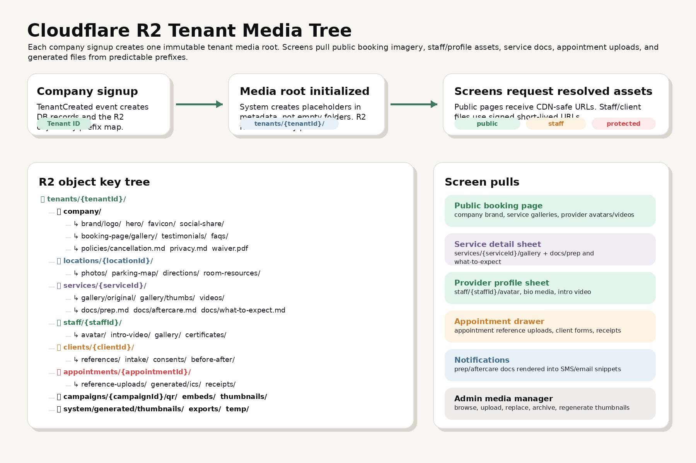
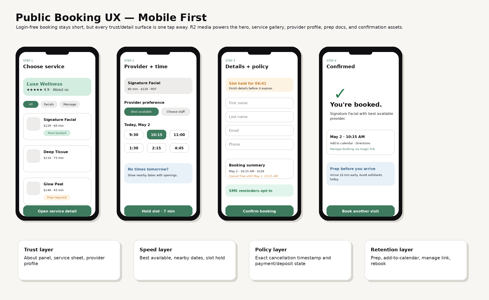
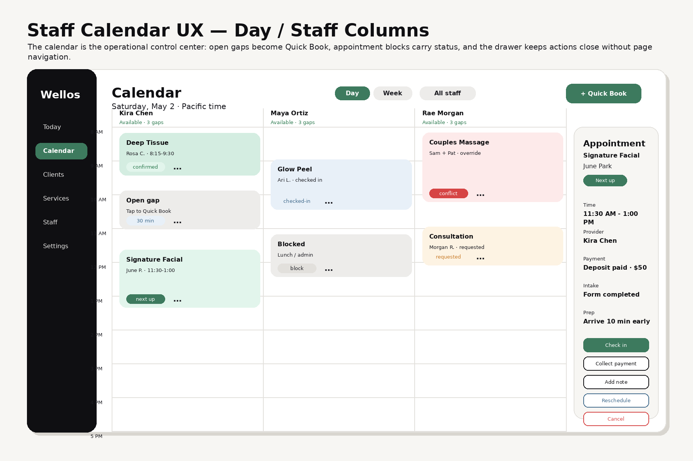
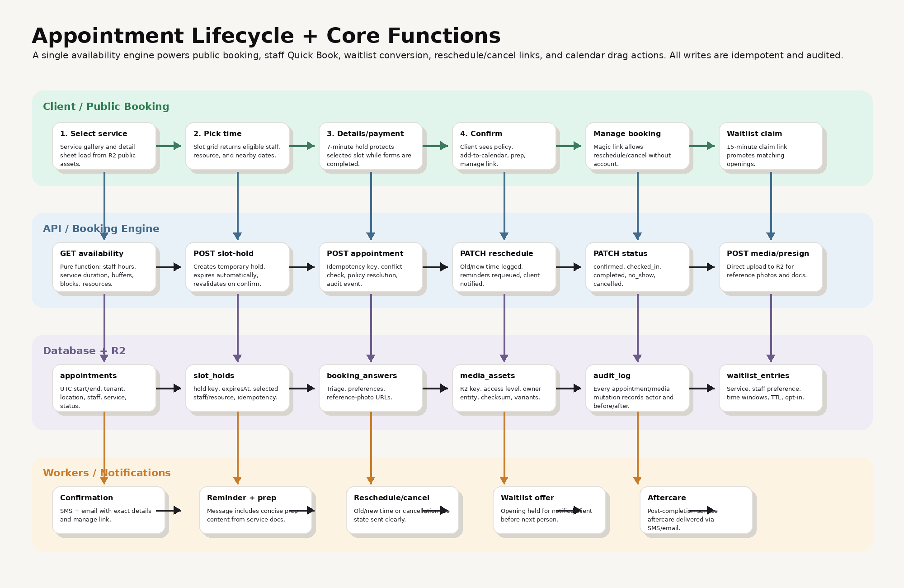
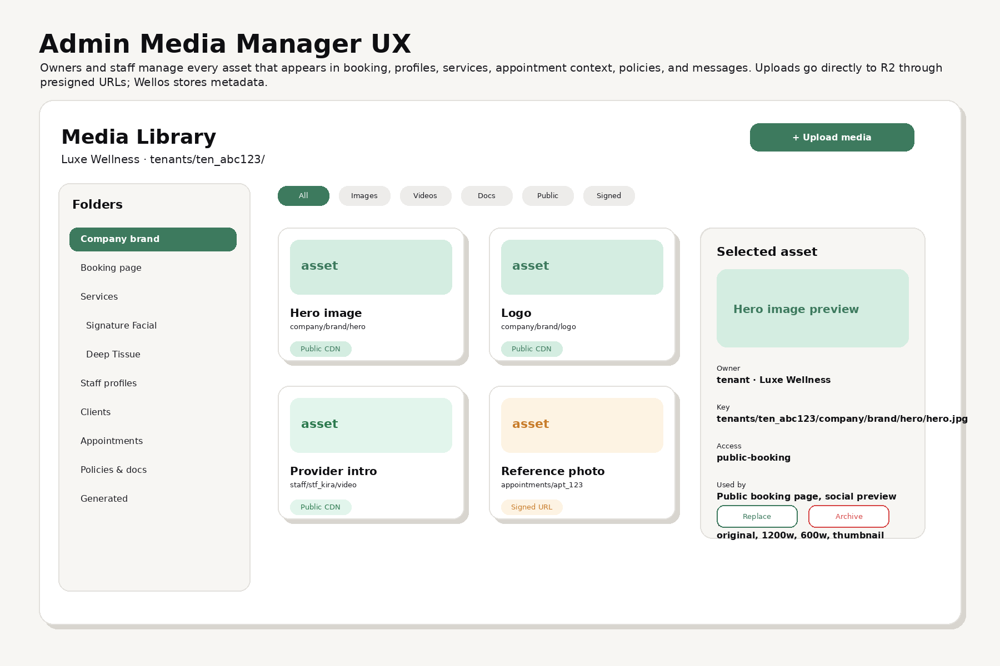
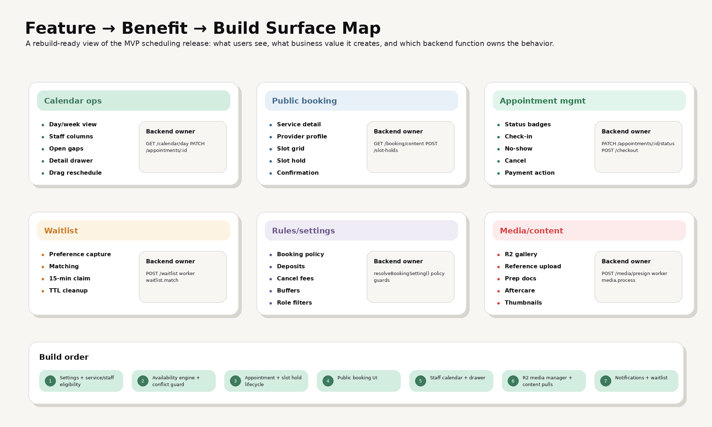

# Wellos — Calendar, Booking, Appointments + Cloudflare R2 UI/UX Buildout

**Purpose:** Rebuild-ready UI/UX and function spec for the calendar, booking, appointment, waitlist, media, and tenant-folder systems.

**Scope:** Calendar, booking portal, appointment lifecycle, slot holds, waitlist, reschedule/cancel, prep/aftercare content, notifications, booking settings, and the Cloudflare R2 media tree used by those screens.

**Primary implementation target:** Wellos / Wellos Studio MVP scheduling release.

---

## 0. Visual package

Use these images as the build reference. They are intentionally schematic, not final marketing mockups.

| Image | What it explains |
|---|---|
|  | How every company gets a tenant media root and how screens pull assets from it. |
|  | Mobile-first public booking flow: service, provider/time, details/policy, confirmation. |
|  | Staff day calendar with columns, open gaps, status cards, and appointment drawer. |
|  | Functional lifecycle from availability search through confirmations, reminders, and waitlist. |
|  | Admin UX for browsing, uploading, replacing, and archiving R2-backed media. |
|  | Feature-to-benefit-to-function map and recommended build order. |

---

## 1. Product model

Wellos booking should feel simple to the client while supporting serious operational logic behind it.

The user-facing system is split into five surfaces:

1. **Public booking portal** — login-free booking for clients.
2. **Staff calendar** — authenticated day/week calendar for staff and front desk.
3. **Appointment drawer / mobile sheet** — action center for check-in, notes, payment, reschedule, cancel, no-show, and files.
4. **Booking settings** — rules that decide what clients can book and what staff can override.
5. **Media/content manager** — Cloudflare R2-backed assets and documents pulled into booking, calendar, reminders, and client records.

The backend should treat these as different UX shells around one shared appointment engine.

---

## 2. Cloudflare R2 tenant folder strategy

### 2.1 Core rule

When a company signs up, Wellos creates a **Tenant** in the database and provisions a media root prefix in Cloudflare R2.

R2 object storage is key-based. The “folders” are object key prefixes, so the database should be the source of truth for folder ownership, access, and usage. Do not depend on empty folders existing in R2.

### 2.2 Recommended bucket layout

Use separate buckets for environment and access level.

```txt
wellos-prod-public-media
wellos-prod-private-media
wellos-prod-protected-media   # future medspa/protected records partition
wellos-staging-public-media
wellos-staging-private-media
```

**Why split buckets:** public assets can be cached and exposed through a custom domain; private/protected files require signed access, stricter logs, and different lifecycle rules.

### 2.3 Tenant root prefix

Use immutable IDs, not company names, in R2 keys.

```txt
tenants/{tenantId}/
```

Example:

```txt
tenants/ten_01HV8Y9X2WJ3/
```

Company names and slugs can change. Tenant IDs should not.

### 2.4 Full object-key tree

```txt
tenants/{tenantId}/

  company/
    brand/
      logo/
      hero/
      favicon/
      social-share/
    booking-page/
      gallery/
      testimonials/
      faqs/
    policies/
      cancellation.md
      privacy.md
      waiver.pdf
    docs/
      public/
      staff-only/

  locations/{locationId}/
    photos/
    parking-map/
    directions/
    rooms/
    resources/

  services/{serviceId}/
    gallery/
      original/
      variants/
      thumbs/
    videos/
    docs/
      what-to-expect.md
      prep.md
      aftercare.md
      contraindications.md
    forms/
      intake-template/
      waiver-template/

  staff/{staffId}/
    avatar/
    intro-video/
    gallery/
    certificates/
    documents/

  clients/{clientId}/
    references/
    intake/
    consents/
    before-after/
    documents/
    exports/

  appointments/{appointmentId}/
    reference-uploads/
    generated/
      calendar.ics
    receipts/
    forms/
    notes-attachments/

  campaigns/{campaignId}/
    qr/
    thumbnails/
    embeds/

  system/
    generated/
      thumbnails/
      optimized/
      exports/
    temp/
```

### 2.5 Access classes

| Access class | Used for | Bucket / prefix | URL behavior |
|---|---|---|---|
| `public_booking` | Logos, service galleries, provider avatars, intro videos, booking-page hero images | Public bucket | CDN/custom-domain URL or durable public object URL |
| `tenant_staff` | Staff-only docs, appointment uploads, internal service docs | Private bucket | Signed GET URL with short TTL |
| `client_owned` | Client reference photos, intake docs, consent PDFs | Private bucket | Signed URL only after RBAC check |
| `protected_medspa` | Clinical photos, treatment images, protected records | Protected bucket | Signed URL, tighter audit, future encryption/compliance rules |
| `generated` | Thumbnails, QR codes, `.ics`, exported PDFs | Depends on object owner | Same access as parent object |

### 2.6 Database tables

#### `media_assets`

```sql
CREATE TABLE media_assets (
  id UUID PRIMARY KEY DEFAULT gen_random_uuid(),
  tenant_id UUID NOT NULL,
  bucket TEXT NOT NULL,
  object_key TEXT NOT NULL,
  access_class TEXT NOT NULL,
  owner_type TEXT NOT NULL, -- tenant | location | service | staff | client | appointment | campaign
  owner_id UUID NOT NULL,
  folder TEXT NOT NULL,
  file_name TEXT NOT NULL,
  mime_type TEXT NOT NULL,
  size_bytes BIGINT NOT NULL,
  checksum_sha256 TEXT,
  width INT,
  height INT,
  duration_seconds INT,
  alt_text TEXT,
  caption TEXT,
  variants JSONB NOT NULL DEFAULT '{}',
  metadata JSONB NOT NULL DEFAULT '{}',
  uploaded_by_user_id UUID,
  archived_at TIMESTAMPTZ,
  created_at TIMESTAMPTZ NOT NULL DEFAULT now(),
  updated_at TIMESTAMPTZ NOT NULL DEFAULT now(),
  UNIQUE (bucket, object_key)
);
```

#### `media_folder_templates`

This is optional, but useful for provisioning and admin UI.

```sql
CREATE TABLE media_folder_templates (
  id UUID PRIMARY KEY DEFAULT gen_random_uuid(),
  product_scope TEXT NOT NULL, -- wellos | studio | both
  owner_type TEXT NOT NULL,
  folder_key TEXT NOT NULL,
  label TEXT NOT NULL,
  default_access_class TEXT NOT NULL,
  required BOOLEAN NOT NULL DEFAULT false,
  display_order INT NOT NULL DEFAULT 0
);
```

#### `tenant_media_roots`

```sql
CREATE TABLE tenant_media_roots (
  id UUID PRIMARY KEY DEFAULT gen_random_uuid(),
  tenant_id UUID NOT NULL UNIQUE,
  public_bucket TEXT NOT NULL,
  private_bucket TEXT NOT NULL,
  protected_bucket TEXT,
  root_prefix TEXT NOT NULL, -- tenants/{tenantId}/
  cdn_base_url TEXT,
  created_at TIMESTAMPTZ NOT NULL DEFAULT now()
);
```

### 2.7 Tenant signup function

Run this during onboarding completion or immediately after tenant creation.

```ts
type ProvisionTenantMediaInput = {
  tenantId: string;
  companySlug: string;
  createdByUserId: string;
};

async function provisionTenantMediaRoot(input: ProvisionTenantMediaInput) {
  const rootPrefix = `tenants/${input.tenantId}/`;

  await db.tenantMediaRoot.create({
    data: {
      tenantId: input.tenantId,
      publicBucket: process.env.R2_PUBLIC_BUCKET!,
      privateBucket: process.env.R2_PRIVATE_BUCKET!,
      protectedBucket: process.env.R2_PROTECTED_BUCKET ?? null,
      rootPrefix,
      cdnBaseUrl: process.env.R2_PUBLIC_CDN_BASE_URL ?? null,
    },
  });

  await db.auditLog.create({
    data: {
      tenantId: input.tenantId,
      actorUserId: input.createdByUserId,
      action: 'tenant.media_root.provisioned',
      after: { rootPrefix },
    },
  });

  return { rootPrefix };
}
```

Do **not** upload placeholder folder objects unless you specifically need them for a UI browser. The preferred source of truth is the metadata row.

---

## 3. R2 upload and pull behavior

### 3.1 Upload flow

```txt
Client/staff selects file
  → POST /api/admin/media/presign
  → API validates tenant, owner, MIME type, size, access class
  → API returns signed PUT URL + objectKey
  → browser uploads file directly to R2
  → POST /api/admin/media/complete
  → API writes media_assets row
  → worker generates thumbnails / optimized variants
  → screen refreshes with resolved URLs
```

### 3.2 Pull flow

Public booking pages should never list R2 directly. They should call the API:

```txt
GET /api/public/booking/:tenantSlug/content
```

Response should include resolved, screen-ready asset URLs:

```json
{
  "tenant": {
    "name": "Luxe Wellness",
    "logoUrl": "https://media.wellos.one/...",
    "heroImageUrl": "https://media.wellos.one/..."
  },
  "services": [
    {
      "id": "svc_123",
      "name": "Signature Facial",
      "gallery": [
        {
          "url": "https://media.wellos.one/...",
          "thumbUrl": "https://media.wellos.one/...",
          "alt": "Treatment room with warm lighting"
        }
      ]
    }
  ]
}
```

Private staff screens should receive short-lived signed URLs only after authentication and RBAC checks.

### 3.3 Media worker functions

| Function | Trigger | Job |
|---|---|---|
| `media.generateVariants` | `media.uploaded` | Create thumbnails, 600w, 1200w, and optimized formats for images. |
| `media.stripExif` | before finalizing image | Remove location/device metadata from client-uploaded photos. |
| `media.scanMime` | upload complete | Verify file type matches allowed MIME and extension. |
| `media.archiveAsset` | admin action | Mark row archived and optionally lifecycle/delete object later. |
| `media.replaceAsset` | admin action | Upload new object, keep old row history, update owner reference. |
| `media.renderMarkdownDoc` | service doc update | Render prep/aftercare markdown into SMS-safe and email-safe text. |

---

## 4. Public booking UI/UX

### 4.1 Flow

```txt
Service selection
  → Service detail sheet
  → Provider preference
  → Date/time slot grid
  → Slot hold
  → Client details + SMS opt-in + payment/deposit
  → Confirmation + add-to-calendar + manage link
```

### 4.2 Step 1 — Service selection

**UI elements**

- Tenant logo and compact trust/about panel.
- Category rail and service search.
- Service cards with image, name, duration, price, description, and badges.
- “Most booked” badge for one service only.
- Service detail sheet with gallery, long description, what to expect, prep, aftercare, and review.

**Pulls from R2**

```txt
company/brand/logo/
company/booking-page/gallery/
services/{serviceId}/gallery/
services/{serviceId}/docs/what-to-expect.md
services/{serviceId}/docs/prep.md
services/{serviceId}/docs/aftercare.md
```

**Function owner**

```txt
GET /api/public/booking/:tenantSlug/content
GET /api/public/booking/:tenantSlug/services/:serviceId
```

### 4.3 Step 2 — Provider preference + time

**UI elements**

- Default toggle: “Best available” vs “Choose provider”.
- Provider cards with avatar, specialty, rating/review snippet, and first available time.
- Provider profile sheet with bio, years experience, specialties, intro video, and gallery.
- Date picker and slot grid.
- Nearby-date suggestions when no availability exists.
- Timezone label.

**Pulls from R2**

```txt
staff/{staffId}/avatar/
staff/{staffId}/intro-video/
staff/{staffId}/gallery/
```

**Function owner**

```txt
GET /api/public/booking/:tenantSlug/availability
POST /api/public/booking/:tenantSlug/slot-holds
```

### 4.4 Step 3 — Client details + policy/payment

**UI elements**

- Slot hold countdown.
- Autofill-friendly client details.
- SMS opt-in checkbox.
- Optional triage/preference questions.
- Optional reference photo upload.
- Summary panel with service, provider, date/time, total, deposit, and exact cancellation deadline.
- Payment area if deposit/full payment/card-on-file is required.

**Pulls from R2**

```txt
services/{serviceId}/forms/intake-template/
appointments/{appointmentId}/reference-uploads/
```

**Function owner**

```txt
POST /api/public/booking/:tenantSlug/uploads/presign
POST /api/public/booking/:tenantSlug/confirm
```

### 4.5 Step 4 — Confirmation

**UI elements**

- “You’re booked” success state.
- Service, provider, date/time, payment/deposit state.
- Add-to-calendar output.
- Manage booking link.
- Directions/parking.
- Prep instructions.
- Rebook or book another service.

**Pulls from R2**

```txt
locations/{locationId}/parking-map/
services/{serviceId}/docs/prep.md
appointments/{appointmentId}/generated/calendar.ics
```

**Function owner**

```txt
GET /api/public/manage/:magicToken
GET /api/public/appointments/:id/calendar.ics
```

---

## 5. Staff calendar UI/UX

### 5.1 Day view

**Purpose:** operational view for today.

**UI elements**

- Staff columns.
- Time rows.
- Appointment blocks.
- Open gaps.
- Blocks/time-off.
- Status badges.
- Next-up marker.
- Past appointment de-emphasis.
- Conflict/override visual marker.
- Pull-to-refresh / schedule refresh.
- Tap open slot to launch Quick Book.

**Function owner**

```txt
GET /api/staff/calendar/day?date=2026-05-02&locationId=...
```

### 5.2 Week view

**Purpose:** planning view for managers and front desk.

**UI elements**

- Week grid grouped by day.
- Staff filters.
- Open capacity and schedule density.
- Drag-to-reschedule.
- Conflict warnings.
- External calendar busy blocks.

**Function owner**

```txt
GET /api/staff/calendar/week?startDate=...
PATCH /api/staff/appointments/:appointmentId/reschedule
```

### 5.3 Appointment block contract

```ts
type CalendarAppointmentBlock = {
  id: string;
  status:
    | 'requested'
    | 'confirmed'
    | 'checked_in'
    | 'in_progress'
    | 'completed'
    | 'no_show'
    | 'cancelled';
  clientName: string;
  serviceName: string;
  staffName: string;
  startLocal: string;
  endLocal: string;
  isPast: boolean;
  isNext: boolean;
  hasConflict: boolean;
  hasIntakeComplete: boolean;
  paymentState: 'none' | 'deposit_paid' | 'card_on_file' | 'balance_due' | 'paid';
  mediaFlags: {
    hasReferencePhotos: boolean;
    hasForms: boolean;
    hasConsents: boolean;
  };
};
```

---

## 6. Appointment drawer / mobile sheet

### 6.1 Drawer tabs

1. **Overview** — appointment facts, status, source, policy.
2. **Client** — phone/email, tags, alerts, visit history.
3. **Payment** — deposit, balance, receipt, collect payment.
4. **Intake** — required forms, status, answers.
5. **Files** — reference uploads, consent docs, receipts.
6. **Notes** — appointment notes and client notes.
7. **Audit** — status changes, reschedules, cancellation, override reason.

### 6.2 Drawer actions

| Action | Effect |
|---|---|
| `Check in` | Moves appointment to `checked_in`; fires check-in alerts. |
| `Start service` | Moves appointment to `in_progress`. |
| `Complete` | Moves appointment to `completed`; schedules aftercare/review flows. |
| `No-show` | Moves appointment to `no_show`; does not free the slot. |
| `Collect payment` | Opens checkout. |
| `Send payment link` | Sends deposit/balance link. |
| `Add note` | Creates appointment or client note. |
| `Upload file` | Uses R2 presigned upload and links asset to appointment/client. |
| `Reschedule` | Opens availability picker; logs old/new time. |
| `Cancel` | Cancels with confirmation; notifies client. |

### 6.3 Files tab pull

```txt
GET /api/staff/appointments/:appointmentId/media
```

Response:

```ts
type AppointmentMediaResponse = {
  referencePhotos: MediaAsset[];
  intakeDocs: MediaAsset[];
  consentDocs: MediaAsset[];
  receipts: MediaAsset[];
  generated: MediaAsset[];
};
```

---

## 7. Appointment lifecycle

### 7.1 State machine

```txt
requested
  → confirmed
  → checked_in
  → in_progress
  → completed

confirmed
  → cancelled
  → no_show

requested
  → declined
  → expired

confirmed
  → rescheduled
  → confirmed
```

### 7.2 Required invariants

- No appointment can be confirmed with an expired slot hold.
- No appointment can be created without rechecking availability.
- No price/deposit total is trusted from the frontend.
- Every mutating request carries an idempotency key.
- Every status transition writes an audit event.
- Staff-created appointments can skip client payment only if policy allows or a manager override exists.
- No-show keeps the slot blocked.
- Cancelled appointment may release waitlist matching depending on timing and policy.

---

## 8. Availability engine

### 8.1 Inputs

```ts
type AvailabilityRequest = {
  tenantId: string;
  locationId: string;
  serviceId: string;
  providerPreference:
    | { mode: 'any_available' }
    | { mode: 'specific_staff'; staffId: string };
  dateRange: {
    startDate: string;
    endDate: string;
  };
  timezone: string;
};
```

### 8.2 Checks

1. Service is active.
2. Staff is active.
3. Staff can perform service.
4. Staff is working during the requested window.
5. Service duration + buffer fits.
6. Required resource/room is available.
7. No appointment conflict.
8. No staff block/time-off conflict.
9. No location blackout.
10. Minimum booking notice is satisfied.
11. Maximum booking horizon is satisfied.
12. Staff/company settings permit booking.

### 8.3 Output

```ts
type AvailabilitySlot = {
  startsAtUtc: string;
  endsAtUtc: string;
  startsAtLocal: string;
  endsAtLocal: string;
  timezoneLabel: string;
  staffId: string;
  staffName: string;
  resourceId?: string;
  assignmentReason:
    | 'specific_staff'
    | 'preferred_staff'
    | 'round_robin'
    | 'least_booked'
    | 'earliest_available';
};
```

---

## 9. Slot holds

### 9.1 Purpose

A slot hold prevents two clients from taking the same time while one client is entering details or payment.

### 9.2 Default

```txt
Hold duration: 7 minutes
```

### 9.3 Table

```sql
CREATE TABLE slot_holds (
  id UUID PRIMARY KEY DEFAULT gen_random_uuid(),
  tenant_id UUID NOT NULL,
  location_id UUID NOT NULL,
  service_id UUID NOT NULL,
  staff_id UUID NOT NULL,
  resource_id UUID,
  starts_at TIMESTAMPTZ NOT NULL,
  ends_at TIMESTAMPTZ NOT NULL,
  expires_at TIMESTAMPTZ NOT NULL,
  status TEXT NOT NULL DEFAULT 'active', -- active | consumed | expired | released
  idempotency_key TEXT,
  created_by_fingerprint TEXT,
  created_at TIMESTAMPTZ NOT NULL DEFAULT now()
);
```

### 9.4 Expiration behavior

- If hold expires during details/payment, show: **“This time was released. Pick a new opening.”**
- If hold fails because the slot was taken, refresh availability and suggest nearby times.
- When confirmed, mark hold as `consumed`.
- Expired holds should be cleaned by worker or DB query filter.

---

## 10. Waitlist

### 10.1 Client signup

When no desired slot exists, the client can join waitlist.

Capture:

- Service.
- Optional provider.
- Preferred dates.
- Preferred time of day.
- Contact name/email/phone.
- Required SMS opt-in.
- TTL, default 14 days.

### 10.2 Matching

A waitlist match can be triggered by:

- Appointment cancellation.
- Staff schedule opening.
- Block removal.
- New provider eligibility.
- Manual staff action.

### 10.3 Claim flow

```txt
Opening appears
  → worker finds eligible waitlist entries
  → first eligible client receives SMS/email
  → system holds slot for 15 minutes
  → client clicks magic claim link
  → client confirms
  → appointment created
  → next waitlist entry skipped because slot is consumed
```

---

## 11. Booking policies

### 11.1 Instant booking

Client confirms and appointment enters `confirmed`.

### 11.2 Request approval

Client submits request and appointment enters `requested`.

Staff receives alert and can approve/decline.

### 11.3 Staff-only

Public booking URL becomes a contact-to-book page. It should still use tenant brand assets from R2.

---

## 12. Two-tier settings resolution

Every booking rule resolves in this order:

```txt
appointment override
  → staff-level value if company permits it
  → company-level value
  → system default
```

### 12.1 Settings needed for MVP

| Setting | Default |
|---|---|
| Booking policy | `instant` |
| Deposits enabled | off |
| Deposit amount | `$50` if enabled |
| Cancellation window | `24 hours` |
| Cancellation fee | same as deposit or `$0` |
| No-show fee | same as cancellation fee |
| Minimum booking notice | `2 hours` |
| Maximum booking window | `90 days` |
| Buffer time | `0 minutes` |
| Service offerings per staff | none until assigned |
| Working hours | business hours |
| Break/lunch scheduling | none |
| Walk-in acceptance | on |
| Tips enabled | on |
| Override/double-book permissions | owner/manager |
| Client recognition strictness | email+phone or email+name |
| Calendar sync enabled | company enables; staff opts in |

---

## 13. Notifications

### 13.1 MVP messages

| Message | Trigger | Channel |
|---|---|---|
| Booking confirmation | appointment confirmed | SMS + email |
| Booking request received | requested appointment created | SMS/email to client; staff alert |
| Approval confirmation | staff approves request | SMS + email |
| Decline notification | staff declines request | SMS + email |
| Reminder | configured offset before appointment | SMS + email |
| Prep reminder | reminder with prep content merged in | SMS/email |
| Reschedule confirmation | time/provider changes | SMS + email |
| Cancellation confirmation | appointment cancelled | SMS + email |
| Waitlist offer | matching opening found | SMS primary |
| Aftercare | appointment completed | SMS/email |

### 13.2 R2 content usage

Prep and aftercare should be stored as service docs:

```txt
services/{serviceId}/docs/prep.md
services/{serviceId}/docs/aftercare.md
```

Workers render them into:

- SMS-safe text.
- Email HTML partial.
- Staff drawer content.

---

## 14. API route map

### 14.1 Public booking

```txt
GET    /api/public/booking/:slug/content
GET    /api/public/booking/:slug/services/:serviceId
GET    /api/public/booking/:slug/availability
POST   /api/public/booking/:slug/slot-holds
POST   /api/public/booking/:slug/uploads/presign
POST   /api/public/booking/:slug/confirm
GET    /api/public/manage/:magicToken
PATCH  /api/public/manage/:magicToken/reschedule
PATCH  /api/public/manage/:magicToken/cancel
POST   /api/public/booking/:slug/waitlist
```

### 14.2 Staff calendar

```txt
GET    /api/staff/calendar/day
GET    /api/staff/calendar/week
POST   /api/staff/appointments
GET    /api/staff/appointments/:id
PATCH  /api/staff/appointments/:id/status
PATCH  /api/staff/appointments/:id/reschedule
PATCH  /api/staff/appointments/:id/cancel
POST   /api/staff/appointments/:id/notes
POST   /api/staff/appointments/:id/media/presign
GET    /api/staff/appointments/:id/media
```

### 14.3 Admin media

```txt
GET    /api/admin/media
POST   /api/admin/media/presign
POST   /api/admin/media/complete
PATCH  /api/admin/media/:assetId
POST   /api/admin/media/:assetId/replace
DELETE /api/admin/media/:assetId
POST   /api/admin/media/:assetId/regenerate-variants
```

### 14.4 Settings

```txt
GET    /api/admin/booking-settings
PATCH  /api/admin/booking-settings
GET    /api/staff/my-booking-preferences
PATCH  /api/staff/my-booking-preferences
```

---

## 15. Components to build

### 15.1 Public booking components

```txt
BookingShell
TenantTrustPanel
CategoryRail
ServiceCard
ServiceDetailSheet
ProviderPreferenceToggle
ProviderCard
ProviderProfileSheet
DatePickerStrip
SlotGrid
NearbyDatesPanel
SlotHoldTimer
ClientDetailsForm
BookingSummaryPanel
PolicyDisclosure
PaymentBlock
ConfirmationCard
ManageBookingActions
WaitlistSignupSheet
ReferencePhotoUploader
```

### 15.2 Staff calendar components

```txt
CalendarShell
CalendarToolbar
StaffColumnHeader
TimeAxis
AppointmentBlock
OpenSlotBlock
BlockTimeCard
ConflictBadge
NextUpMarker
AppointmentDrawer
AppointmentMobileSheet
AppointmentActionBar
StatusBadge
CalendarRefreshButton
QuickBookSheet
```

### 15.3 Media components

```txt
MediaLibraryPage
FolderTree
MediaAssetGrid
MediaAssetCard
MediaDetailPane
UploadDropzone
AccessClassBadge
ReplaceAssetDialog
ArchiveAssetDialog
VariantPreviewList
R2ObjectKeyDisplay
```

---

## 16. MVP build order

### Step 1 — Data + settings foundation

Build:

- Appointment model.
- Slot hold model.
- Waitlist model.
- Booking settings tables.
- Media asset model.
- Tenant media root provisioning.
- Staff/service eligibility already connects to Epic 2 data.

Acceptance:

- Tenant signup creates media root metadata.
- Admin can resolve tenant media root.
- Booking setting resolution returns deterministic values.

### Step 2 — Availability engine

Build:

- Availability function.
- Staff hours.
- Service duration and buffers.
- Existing appointment conflicts.
- Block/time-off conflicts.
- Minimum notice and max horizon.
- DB-level no-double-booking guard.

Acceptance:

- Two concurrent booking attempts cannot create overlapping appointments for same staff.
- DST and timezone tests pass.
- Inactive staff/services never appear.

### Step 3 — Appointment lifecycle

Build:

- Slot holds.
- Appointment creation.
- Status transitions.
- Reschedule/cancel functions.
- Audit log.

Acceptance:

- Expired holds cannot confirm.
- Reschedules log old/new time.
- No-show does not release slot.
- Cancelled appointment can trigger waitlist matching.

### Step 4 — Public booking portal

Build:

- Booking content endpoint.
- Service selection.
- Service detail sheet.
- Provider preference.
- Slot grid.
- Details/payment/policy step.
- Confirmation.

Acceptance:

- First-time client can book in under 90 seconds on mobile.
- Direct service/staff links preselect the right data.
- Exact cancellation deadline is shown before confirmation.

### Step 5 — Staff calendar

Build:

- Day view.
- Week view.
- Staff columns.
- Appointment block.
- Open slot Quick Book.
- Appointment drawer.
- Drag-to-create.
- Drag-to-reschedule.

Acceptance:

- Staff can create a walk-in booking in under 30 seconds.
- Desktop calendar appointment creation is under 20 seconds.
- Provider role only sees allowed schedules.

### Step 6 — R2 media manager

Build:

- Presigned upload.
- Complete upload.
- Media library.
- Asset replacement.
- Archive.
- Image variant worker.
- Public booking asset resolver.

Acceptance:

- Service gallery uploaded in admin appears in public booking.
- Provider avatar uploaded in admin appears in provider sheet.
- Appointment reference photo appears in appointment drawer.
- Private asset URLs expire and require authorization.

### Step 7 — Notifications + waitlist

Build:

- Confirmation messages.
- Reminder messages.
- Prep content merge.
- Reschedule/cancel messages.
- Waitlist matching and claim links.
- Aftercare delivery.

Acceptance:

- Old reminders are cancelled after reschedule.
- Waitlist hold is time-boxed.
- Prep/aftercare pulls service content and does not require manual texting.

---

## 17. Rebuild acceptance checklist

### Public booking

- [ ] Client can book without creating an account.
- [ ] Service cards show duration, price, image, and short description.
- [ ] Service detail sheet includes gallery, what to expect, prep, and aftercare.
- [ ] Provider preference defaults to best available.
- [ ] Provider profile sheet includes avatar, bio, specialty, gallery/video.
- [ ] Slot grid only shows real openings.
- [ ] Slot hold timer is visible.
- [ ] Exact cancellation timestamp appears before confirmation.
- [ ] SMS opt-in is explicit and unchecked by default.
- [ ] Confirmation includes add-to-calendar and manage booking link.

### Staff calendar

- [ ] Day view shows staff columns.
- [ ] Week view supports staff filtering.
- [ ] Appointment block has service, client, provider, time, status.
- [ ] Open gaps are visible.
- [ ] Tapping an open gap launches Quick Book with time prefilled.
- [ ] Drawer actions: check-in, no-show, collect payment, note, reschedule, cancel.
- [ ] Past appointments are de-emphasized.
- [ ] Next appointment is highlighted.
- [ ] Conflict override has visible marker and audit reason.

### R2 media

- [ ] Tenant media root is created on signup.
- [ ] Public bucket assets can be resolved for booking screens.
- [ ] Private bucket assets require signed URL and RBAC check.
- [ ] Client uploads strip EXIF.
- [ ] Thumbnails/variants are generated.
- [ ] Media asset rows store owner entity and object key.
- [ ] Replacing an asset does not break audit history.
- [ ] Archived assets stop appearing but remain reportable.

### Functions

- [ ] Every mutating booking endpoint supports idempotency.
- [ ] Appointment status transitions are enforced server-side.
- [ ] Availability rechecks before confirmation.
- [ ] DB prevents double booking.
- [ ] Reminder jobs are requeued after reschedule.
- [ ] Waitlist offers expire and move to the next eligible client.
- [ ] All appointment/media mutations write audit logs.

---

## 18. Naming conventions

### R2 object key

```txt
tenants/{tenantId}/{ownerType}/{ownerId}/{folder}/{assetId}-{safeFileName}
```

Examples:

```txt
tenants/ten_123/services/svc_456/gallery/original/ast_789-facial-room.jpg
tenants/ten_123/staff/stf_456/avatar/ast_222-kira-avatar.webp
tenants/ten_123/appointments/apt_999/reference-uploads/ast_444-inspo-photo.jpg
```

### Media asset ID

Use DB IDs, not filenames, as the durable reference.

```txt
ast_{id}
```

### Slugs

Slugs are for URLs only:

```txt
/book/luxe-wellness
/book/luxe-wellness/services/signature-facial
```

Never use slugs as storage identity.

---

## 19. Notes for implementation

- Use Cloudflare R2 through the S3-compatible API from the backend.
- Use presigned URLs for browser uploads and signed reads.
- Do not expose R2 credentials to the browser.
- Store object keys, not public URLs, in the database.
- Resolve URLs at request time so CDN/custom-domain changes do not require data migrations.
- Keep public booking images cached aggressively.
- Keep private/protected assets signed and short-lived.
- Put all money fields in integer cents.
- Store all appointment times in UTC and render local time from the tenant/location timezone.
- Use tenant ID in every table and every media key.
- Keep Wellos and Wellos Studio on the same backend and tenant model; Studio is a simplified feature set, not a separate system.

---

## 20. Developer handoff summary

Build this as one scheduling/media epic with seven sub-epics:

1. Tenant media root + R2 upload pipeline.
2. Availability engine and no-double-booking guard.
3. Slot holds and appointment lifecycle.
4. Public booking portal.
5. Staff calendar and appointment drawer.
6. Waitlist/reschedule/cancel.
7. Notifications and prep/aftercare content delivery.

The design objective is: **simple for clients, operationally correct for staff, tenant-safe for data, and R2-driven for every image/video/doc surface.**
